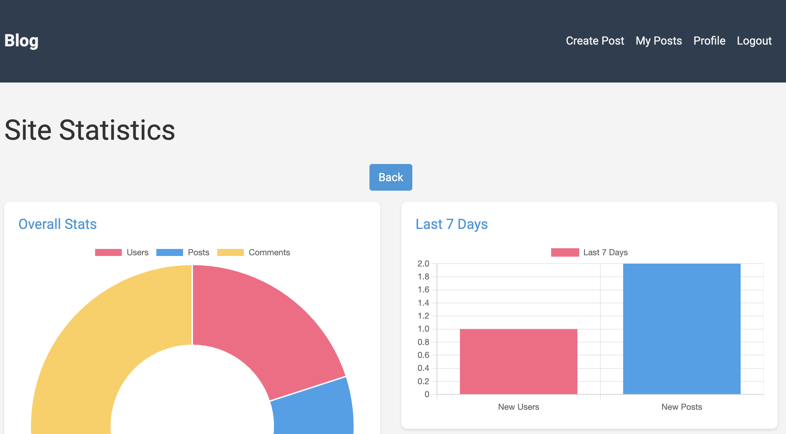

<a id="readme-top"></a>

<!-- PROJECT LOGO -->
<br />

<div align="center">
  <a href="https://github.com/biu0924/Blog_ML">
    
  </a>
<h3 align="center">MyBlog</h3>

</div>


<!-- ABOUT THE PROJECT -->

## About The Project

项目展示


<p align="right">(<a href="#readme-top">back to top</a>)</p>

<!-- GETTING STARTED -->

## Getting Started

### Usage

* 虚拟环境
  
  1. 先进入项目目录，执行以下操作
  
  ```sh
  python -m venv .venv
  source .venv/bin/activate
  . .venv/bin/activate
  
  ```

​	2. pip requirements

​		```pip install -r requirements.txt```

​	3. 安装数据库

​		前往 Postgresql 官网 [下载](https://www.postgresql.org/download/)

​		创建数据库

​		```createdb blogdb```	

​			如果报错，使用绝对地址或直接前往 postgresql 项目下的 bin 文件夹内执行上述代码

​		访问数据库

​		```psql blogdb```

​		创建新用户

​			```CREATE USER username WITH PASSWORD 'your_password';```

​			这里我写的是

​			``` CREATE USER root WITH PASSWORD '123456';```

​		为用户分配权限

​			```ALTER USER root blogdb;```

​		`\q` 退出

​	4. 迁移数据库 

​		在项目目录下，

​		```flask db init```

​		```flask db migrate -m "initial migration"```

​		```flask db upgrade```

​	5.运行	

​		```flask --app run run --debug ```

​		或者使用 gunicorn 服务器运行

​		```gunicorn --bind 127.0.0.1:8000 --workers 17 --log-level debug run:app```

- Docker 运行(推荐)

  首先，确保你的本地环境安装了docker引擎服务

  然后，进入 /dockerfiles 目录内

  ```docker-compose up --build```

  然后就可以运行了

​		```flask --app run run --debug ```

​		或者使用 gunicorn 服务器运行

​		```gunicorn --bind 127.0.0.1:8000 --workers 17 --log-level debug run:app```

### 展示

- 主页


- 写博客

  

- 查看自己的博客

​	

- 查看个人简介

​	

- 此外还有超级管理员功能



<!-- USAGE EXAMPLES -->

## Note

注意，超级管理员功能需要有超级管理员权限才能使用，处于安全考虑，我没有在前端写超级管理员功能。

需要专门的用户在进入数据库直接进行对数据库表进行更改

- 虚拟环境版

​	如果有navicat这种数据库可视化工具，可以直接连接数据库，对用户进行管理

​	如果没有，下列操作：

​		先进入数据库 ```psql blog```

​		查表 ```\dt```

​			{:width="30px" height="30px"}

​		对 user 进行修改(当前，你需要先注册之后才能执行该操作)

​		```UPDATE "user" SET is_admin = TRUE WHERE id = 1		```

- docker 版

  先 cd 进入 dockerfiles 文件夹内部，

  1. docker正在运行的容器 ```docker ps```

  2. 找到 Postgresql 的容器

  3. 然后进入容器 ```docker exec -it <container_name> bash```（或者把 bash 换成 sh）
  4. 然后执行上面的操作就可以了
  5. 退出容器 ```exit```


<p align="right">(<a href="#readme-top">back to top</a>)</p>

